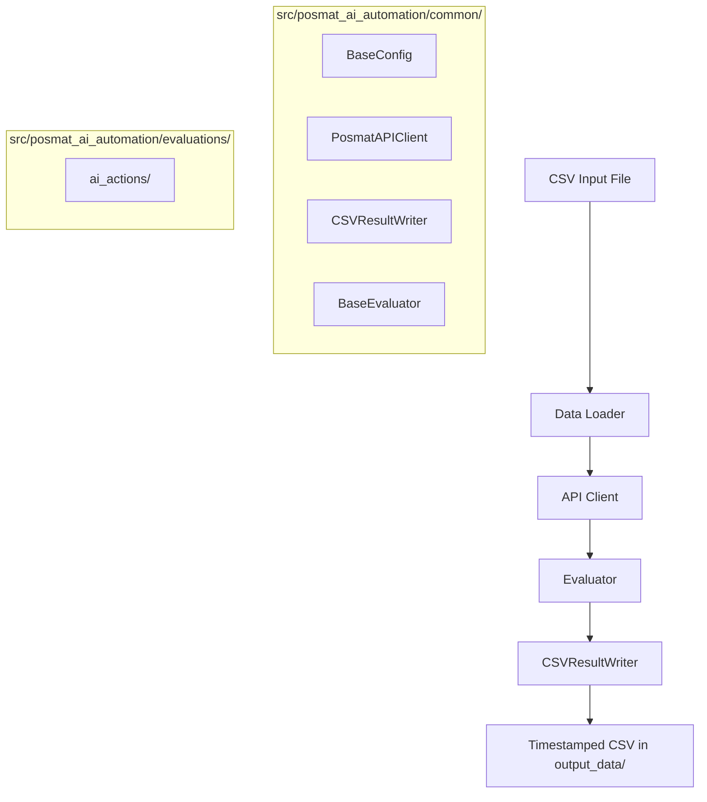

# AGENTS.md

Guidance for AI agents working in this repository.

## Shell Scripts - Primary Entry Points

All runs should be started from the project root. Extra CLI flags are forwarded via `"$@"`.

| Script | Command | Purpose |
|--------|---------|---------|
| `run_posmat_ai_actions.sh` | `bash shell_scripts/run_posmat_ai_actions.sh` | Create users, update bot attributes, trigger AI actions, and save a timestamped CSV report |

## Project Purpose

This repository automates Posmat AI action checks against the public bot API. It supports:

- CSV-driven API runs for repeatable action checks
- Attribute population from bot content metadata
- SSE parsing to extract triggered action names and outputs
- Timestamped CSV reporting for downstream analysis
- Dry-run execution for payload validation without live API calls

## Architecture Overview



## Repository Structure

```text
posmat-api-automation/
|- src/posmat_ai_automation/
|  |- common/
|  |  |- api_client.py
|  |  |- config.py
|  |  |- data_writer.py
|  |  `- evaluator.py
|  |- evaluations/ai_actions/
|  |  |- config.py
|  |  |- data_loader.py
|  |  |- evaluator.py
|  |  `- models.py
|  `- cli.py
|- shell_scripts/
|  `- run_posmat_ai_actions.sh
|- run_posmat_ai_actions.py
|- input_data/
|- output_data/
|- docs/
|- .env.example
|- pyproject.toml
`- README.md
```

## Environment Variables

The most important variables are:

| Variable | Required | Description |
|---|---|---|
| `BASE_URL` | Yes | Posmat API base URL |
| `API_TOKEN` | Yes | Raw authorization token used by the collection |
| `BOT_PUBLIC_ID` | Yes | Bot identifier used in public API routes |
| `REQUEST_TIMEOUT` | No | Per-request timeout in seconds |
| `BOT_CONTENT_PATH` | No | Bot content JSON used to build the attribute catalog |
