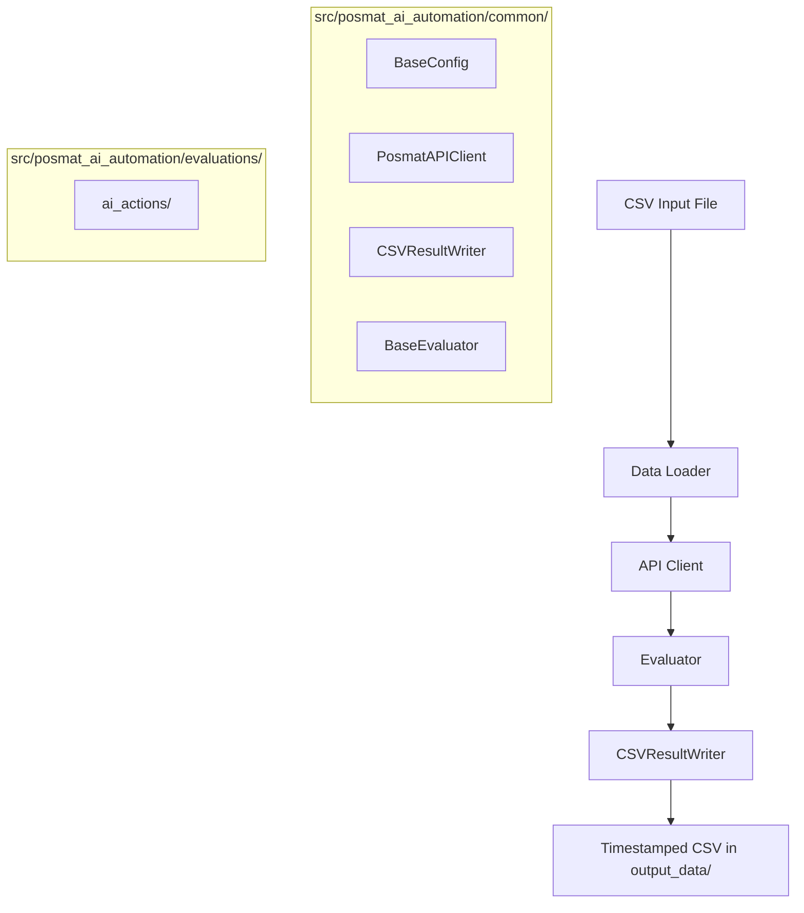

# Posmat API Automation

Structured API automation for Posmat AI actions, organized to mirror the `results-chatbot-ai-evals` layout.

## Shell Scripts

All runs should start from the project root. The primary entry point is:

```bash
bash shell_scripts/run_posmat_ai_actions.sh --input input_data/input.csv
```

The manual command for IntelliJ IDEA or a local terminal still works and is the easiest way to run the project directly:

```powershell
.venv\Scripts\python.exe run_posmat_ai_actions.py --input input_data\input.csv
```

## Project Purpose

This project sends CSV-defined test rows through the Posmat public API, updates bot attributes from bot content metadata, triggers AI actions, and saves a timestamped CSV with extracted results.

## Architecture Overview



## Repository Structure

```text
posmat-api-automation/
|- src/posmat_ai_automation/
|  |- common/
|  |  |- api_client.py
|  |  |- config.py
|  |  |- data_writer.py
|  |  `- evaluator.py
|  |- evaluations/ai_actions/
|  |  |- config.py
|  |  |- data_loader.py
|  |  |- evaluator.py
|  |  `- models.py
|  `- cli.py
|- shell_scripts/
|  `- run_posmat_ai_actions.sh
|- run_posmat_ai_actions.py
|- input_data/
|- output_data/
|- docs/
|- .env.example
|- AGENTS.md
|- pyproject.toml
`- requirements.txt
```

## Setup

```powershell
cd D:\IdeaProjects\posmat-api-automation
uv venv
.venv\Scripts\activate
uv sync
```

## Environment Variables

Copy `.env.example` to `.env` and fill in:

- `BASE_URL`
- `API_TOKEN`
- `BOT_PUBLIC_ID`
- `REQUEST_TIMEOUT`
- `BOT_CONTENT_PATH`

`BOT_CONTENT_PATH` defaults to `C:/Users/bohda/Downloads/botContent.json`.

## Scripts

### run_posmat_ai_actions.py

Shell script: `bash shell_scripts/run_posmat_ai_actions.sh`

Creates a user for each CSV row, updates supported attributes, triggers the AI action flow, parses the SSE response, and writes a timestamped CSV to `output_data/`.

**How it works**

1. Loads runtime configuration from `.env`.
2. Reads input rows from CSV while preserving order.
3. Builds an attribute catalog from the bot content JSON.
4. Creates a user and updates matching attributes for each row.
5. Sends the trigger input to the chat endpoint and extracts the action name and output from SSE events.
6. Writes ordered results to `output_data/run_posmat_ai_actions_YYYYMMDD_HHMMSS.csv`.

**Input CSV columns**

| Column | Required | Description |
|---|---|---|
| `input` | Yes | User message sent to the trigger endpoint |
| `trigger_input` | No | Fallback column name if `input` is empty |
| `email`, `username`, `first_name`, `last_name`, `display_name`, `full_name` | No | Optional persona fields forwarded when creating the chat user |
| `attr_<name>` | No | Optional attribute value mapped to bot content attribute `<name>` |
| `<attribute_name>` | No | Direct attribute column when it exists in bot content |
| `attributes_json` | No | JSON object of attribute overrides |

**Output CSV columns**

| Column | Description |
|---|---|
| `row_index` | One-based input row index |
| `user_id` | User ID returned by create user |
| `chat_id` | Chat ID returned by create user |
| `triggered_ai_action_name` | Extracted action name from SSE events |
| `ai_action_output` | Extracted action output from SSE events |
| `input` | Trigger text used for the request |

**CLI options**

```powershell
.venv\Scripts\python.exe run_posmat_ai_actions.py --input input_data\input.csv - run the script in Idea.
.venv\Scripts\python.exe run_posmat_ai_actions.py --input input_data\input.csv --workers 5
.venv\Scripts\python.exe run_posmat_ai_actions.py --input input_data\input.csv --timeout 90
.venv\Scripts\python.exe run_posmat_ai_actions.py --input input_data\input.csv --dry-run
.venv\Scripts\python.exe run_posmat_ai_actions.py --bot-content C:\path\to\botContent.json
```

## Notes

- The script still accepts the old `python src\run_posmat_ai_actions.py ...` invocation.
- Attribute updates are sent with the per-row `chat_id`, while the chat trigger still uses the per-row `user_id`.
- Output files are written to `output_data/`.
- Research notes remain in `docs/api_research.md`.

